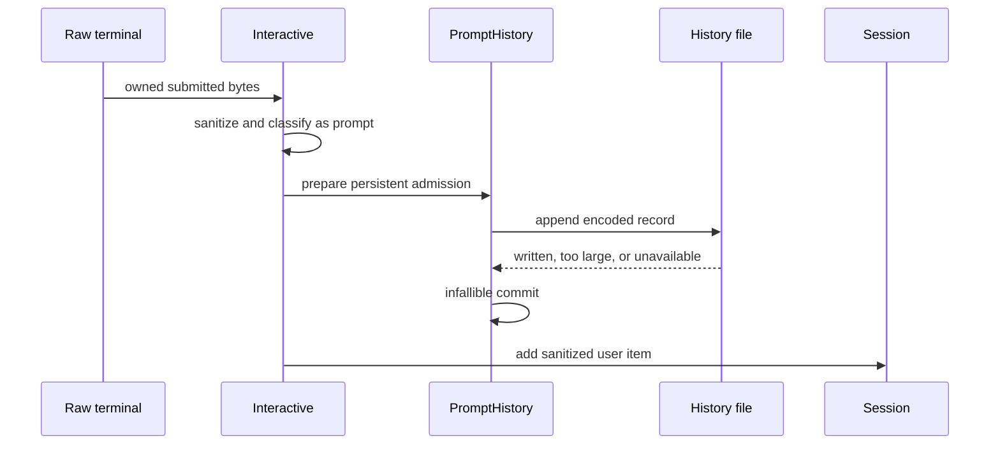
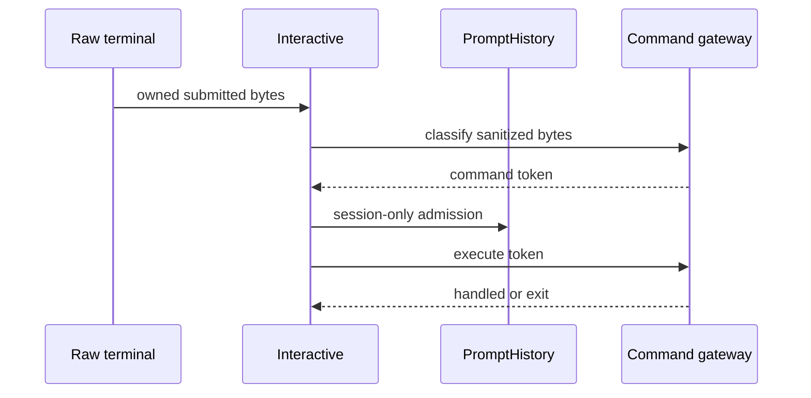
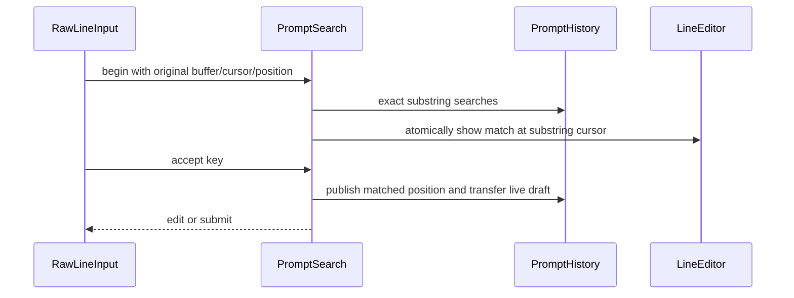

# Prompt-recall system architecture

Status: approved

References:

- Product contract: `docs/prompt-recall-product.md`
- Approved research: `docs/prompt-recall-research.md`
- Slash-command architecture: `docs/slash-commands-architecture.md`
- hax behavior revision: `189816fb8b02956a6913d7638e6d2cc90a91d61a`
- zig-ai design reference: `e2c5aef5f93015322891028a2048a217e7081687`

## Boundaries

Prompt recall spans three existing modules without creating a new top-level module:

- `terminal` owns retained prompt values, navigation, search state, key behavior, and
  normal-buffer rendering.
- `persistence` owns the history record format and every filesystem operation.
- `cli` decides whether submitted terminal input is process-local command history or
  persistable ordinary history and composes the terminal and persistence owners.

`agent`, `ai`, tools, providers, and session JSONL know nothing about prompt recall.
Prompt history is not conversation history and never becomes model context until the
user submits a recalled line through the ordinary prompt path.

Dependencies stay one-way. Terminal code sees only an erased append capability;
persistence sees only erased load/source adapters; `cli.PrintRun` binds concrete
implementations. Neither `terminal` nor `persistence` imports `cli`.

## Components

### Bounded prompt-history owner

`terminal.PromptHistory` is the process-lifetime owner. `PrintRun` constructs it at a
stable address before `RawLineInput` and deinitializes it after the REPL.

It owns:

- an oldest-first list of at most 1000 individually allocated entries;
- a navigation position where `entries.len` denotes the live draft;
- an optional separately owned live draft;
- whether the newest entry was admitted session-only and still needs one persistent
  promotion;
- an optional erased append capability borrowed from the persistence owner. Its typed
  contract is `error{OutOfMemory}!AppendOutcome`, where `AppendOutcome` is `written`,
  `too_large`, or `unavailable`. Persistence collapses every non-allocation failure
  into an outcome.

Entries are individually owned rather than arena-owned. Erasedups and drop-oldest
must release bytes immediately instead of retaining evicted prompts for the process
lifetime.

The owner exposes four kinds of operation:

- seed one decoded persistent entry during startup;
- prepare and commit a session-only or persistent admission;
- prepare and commit older/newer navigation against current editor bytes;
- allocation-free exact substring search and search-result adoption.

No public operation exposes mutable entry storage. Borrowed entry slices remain valid
only until the next history mutation. `beginRead` resets the position to `entries.len`
and releases any stale draft before each fresh `RawLineInput.read`; navigation state
never leaks from one submitted editor into the next.

### Transactional admission

Admission uses an internal move-only prepared value, following zig-ai's prepare then
publish posture.

Preparation:

1. validates non-empty input and the prompt-size bound;
2. locates an existing exact duplicate;
3. allocates the replacement entry and any list capacity needed;
4. determines eviction, duplicate removal, persistence intent, and newest-promotion
   state without changing the owner.

For persistent admission, the encoded append callback runs only after preparation.
`written`, `too_large`, and `unavailable` append outcomes are ignored for REPL control
flow. Only `OutOfMemory` from record preparation propagates before publication. Commit
then performs only pointer moves, index shifts, frees, and scalar updates and cannot
fail.

This ordering guarantees:

- allocation failure leaves history and editor unchanged;
- filesystem failure still publishes process-local recall;
- a session-only newest value later submitted normally gets one append attempt;
- repeating an already persistently admitted newest value does nothing;
- re-adding an older entry moves one exact value to newest.

After an append I/O failure, Zi records that the persistent admission was attempted,
matching hax's best-effort behavior rather than retrying every repeat forever.

### Prepared navigation

History and editor are separate owners, so navigation cannot mutate one and then fail
while updating the other.

A prepared navigation owns a replacement draft when first moving away from live
input and borrows the target retained entry. `RawLineInput` atomically installs the
target into `LineEditor`, then commits the history position and draft with no further
allocation. If editor replacement fails, the plan is destroyed and both owners keep
their old state.

Moving newer to the live position borrows the owned draft. Commit transfers or
releases it only after the editor accepts the replacement. Edits to recalled content
therefore never mutate retained entries.

### Incremental-search state

`terminal/PromptSearch.zig` is an internal pure state machine registered for tests by
`terminal/root.zig`. It is short-lived inside one `RawLineInput.read` call.

It owns:

- the original editor bytes and cursor;
- the original history position;
- the single-line query, bounded by `max_prompt_bytes`;
- current direction, optional match index, and no-match state.

It borrows `PromptHistory` synchronously for allocation-free searches. Query mutation
is prepared before editor replacement. Accepting a match transfers the saved original
buffer into `PromptHistory` as the live draft when search began from the live
position; this makes acceptance allocation-free and preserves Down-to-draft behavior.
Cancellation restores the original editor bytes and cursor without changing history.

The state machine returns explicit outcomes:

- continue searching;
- accept into normal editing;
- accept and submit, only for CR with a valid non-empty match;
- cancel and restore;
- EOF or terminal error after restoring the original editor.

LF always accepts without submitting. CR with an empty query or no match restores the
original and returns to editing. Search uses a dedicated bounded escape reader: lone
Escape accepts after timeout, bracketed-paste begin continues into the query collector,
and every other complete or timed-out escape sequence is consumed before accepting.
No trailing escape bytes leak into normal editing.

The state machine does not poll descriptors or render escape sequences. Those remain
`RawLineInput` responsibilities.

### Raw terminal integration

`RawLineInput.Options` gains an optional borrowed `*PromptHistory` plus borrowed
search accent and no-match styles. Existing tests and embedders may leave history null.

`LineEditor` remains the byte editor and escape decoder. It adds:

- Ctrl-P and Ctrl-N mappings to the existing history outcomes;
- a Ctrl-R history-search outcome;
- borrowed cursor inspection and bounded atomic buffer-and-cursor replacement.

`RawLineInput` handles the semantic outcomes because it owns terminal polling and
borrows process history:

- every `read` calls `history.beginRead()` before entering prompt mode;
- older/newer navigation prepares history, replaces the editor, commits, and repaints;
- Ctrl-C on non-empty input first admits the borrowed draft session-only, resets
  history to the live position and releases its saved draft, then lets the editor
  clear it;
- Ctrl-R runs the modal `PromptSearch` loop without leaving raw prompt mode;
- bracketed search paste reuses the existing bounded paste reader with a query sink
  that drops controls and newlines;
- all exit and error paths use the existing `finish`, `cleanup`, and errdefer paths.

`repaint` is refactored around internal paint options:

- prompt bytes, normally the configured main prompt;
- continuation column, normally main-prompt width;
- exit notice and clear-screen flags.

Search supplies a clipped one-row prompt and continuation column zero. It reuses
`EditLayout`, `DisplayColumns`, synchronized output, cursor tracking, resize handling,
and erase-below. It never starts a picker or enters the alternate screen.

### Prompt-recall admission seam

`Interactive.Inputs` gains a separate optional erased `PromptRecall` capability:

```zig
pub const RecallKind = enum { session, persistent };

pub const PromptRecall = struct {
    context: *anyopaque,
    admit_fn: *const fn (*anyopaque, []const u8, RecallKind) anyerror!void,
};
```

This is separate from `PromptInput`: reading and post-classification admission happen
at different times, and keeping the interfaces separate avoids forcing cooked-input
and test readers to pretend they own history.

`RawLineInput` supplies both erased views over the same stable instance. The recall
view forwards to its borrowed `PromptHistory`. If no history is configured, it is a
no-op.

The borrowed submitted bytes remain owned by `terminal.Result` for the synchronous
admission call. Anything retained is deep-copied by `PromptHistory`.

### Two-phase command gateway

Faithful admission requires command shape to be known before command execution. The
slash gateway therefore separates allocation-free classification from fallible
execution:

```zig
classify(line) -> prompt | command token
execute(command token) -> handled | exit
```

The token is a concrete non-owning value:

```zig
pub const CommandToken = struct {
    gateway_context: *anyopaque,
    execute_fn: *const fn (*anyopaque, CommandToken) anyerror!CommandOutcome,
    registry_index: ?usize,
    name: []const u8,
    argument: ?[]const u8,
    usage: enum { valid, unknown, bad_usage },
};
```

The optional index addresses immutable process-lifetime registry storage owned through
`gateway_context`; it never points at a local parsed value. Name and argument borrow
the sanitized allocation, which `Interactive.run` retains through synchronous
execution. Unknown names and bad usage are command tokens because they are consumed
command input. Classification performs no output and invokes no handler.

`Interactive.run` follows this order for each non-empty terminal submission:

1. retain the original editor bytes through the end of classification and admission;
2. create the bounded model-facing sanitized value;
3. classify sanitized input;
4. for a command token, admit original bytes as `session`, then execute it;
5. for ordinary input, admit original bytes as `persistent`, then call
   `Session.addUser` with sanitized bytes;
6. continue through durability and provider execution only for ordinary input.

Command-handler output or terminal failure can occur only after command admission.
An exit command is admitted before the REPL returns. Empty resume input bypasses both
classification and recall.

### Prompt-history file adapter

`persistence.PromptHistoryFile` owns the `<state_root>/history` contract. It is
exported and test-registered by `persistence/root.zig`.

It contains no global paths or ambient I/O. Construction receives allocator, `std.Io`,
a validated state root, writable/read-only mode, explicit nonce source, and erased
startup entry adapters.

Startup decoding feeds records into a temporary `PromptHistory` through a synchronous
erased sink. A source callback enumerates the final retained entries if compaction is
needed. This keeps erasedups in one implementation without making persistence import
terminal. `PrintRun` publishes the temporary owner only after startup succeeds.

The file adapter owns any open state-directory and lock-file descriptors and exposes
an erased append capability for the terminal owner. The capability's context remains
valid for the REPL lifetime.

### File safety and coordination

Filesystem operations are descriptor-relative beneath an opened private state root.
Writable setup creates missing state directories with mode 0700. History, lock, and
temporary files use mode 0600. Existing final symlinks, directories, devices, FIFOs,
and multiply linked managed leaves are rejected before content I/O.

A sibling intrinsic lock file coordinates cooperating Zi processes:

- writable setup may create the mode-0700 state directory and mode-0600 lock;
- read-only setup opens only existing directories, lock, and history and never calls
  create, chmod, compact, or rename;
- if read-only history exists without a lock, Zi opens and validates one stable
  history descriptor and streams that snapshot without creating a lock;
- startup load and ordinary append hold a shared advisory lock when writable;
- startup compaction holds an exclusive advisory lock;
- multiple appenders may therefore use `O_APPEND` concurrently;
- compaction acquires exclusive ownership, then reopens and reloads the current named
  `history` before publishing its replacement;
- lock acquisition uses bounded nonblocking attempts, then degrades to in-memory
  recall rather than hanging input;
- unsupported or unsafe locking disables writes and compaction for that owner.

Append prepares one encoded record no larger than 65,536 bytes. It then acquires the
shared lock, opens the current named `history` descriptor-relative with
`O_APPEND|O_CLOEXEC|O_NOFOLLOW|O_NONBLOCK` and `O_CREAT`, validates regular type and
`nlink == 1`, performs one raw POSIX write including the final newline, closes that
descriptor, and releases the lock. No history descriptor survives a lock operation
or compaction rename.

This is the one narrow raw-file path: Zig 0.16 `std.Io.File` has no append-open option.
Atomic close-on-exec means it does not need `ProcessSpawn`; any future fallback with
non-atomic descriptor setup must be composed under that coordinator.

A short append is not retried because another shared-lock writer could interleave the
retry. It is reported internally as unavailable and never blocks the REPL.

Compaction streams retained encoded records to one exclusive mode-0600 sibling
file, syncs it, atomically renames it over `history`, and syncs the directory. The old
file remains selected until rename. Any pre-rename failure removes the temporary and
leaves the old file intact. Post-rename directory-sync failure is best-effort and does
not poison later appends.

No whole history file is retained in memory. Loading uses one reusable 65,536-byte
record buffer, drains oversized records, and saturates the physical-record count.
Compaction streams at most 1000 retained entries instead of constructing a possible
64 MiB replacement blob.

### Process composition

`PrintRun` enables prompt recall only when both stdin and stdout are TTYs.

For raw interactive mode it:

1. creates a temporary empty `PromptHistory`;
2. if a state root exists, asks `PromptHistoryFile` to load in writable or read-only
   mode according to resolved no-session policy;
3. treats filesystem outcomes as unavailable but propagates allocation failure;
4. publishes the loaded history and keeps any file owner at a stable address;
5. attaches the append capability only in writable mode;
6. constructs `RawLineInput` borrowing the history and styles;
7. gives `Interactive` the raw input view and recall-admission view.

After `Interactive.run` returns, composition destroys the erased raw/recall views,
detaches the append capability, deinitializes `PromptHistory`, and only then
deinitializes `PromptHistoryFile` and closes its callback context. Startup errdefers
follow the same ownership order and remove any unpublished temporary leaf.

Cooked interactive mode constructs none of these objects and retains its current
behavior.

The initial writable decision reuses the same resolved `no_session` value as session
recording. The later provider-selection milestone must notify this owner when an
`auto` recording policy changes. Disabling first detaches the append capability.
Enabling fallibly performs writable directory/lock setup before attaching it; failure
leaves recall read-only. Neither transition moves `PromptHistory` or creates state
while disabled.

## Runtime flows

### Ordinary prompt



### Handled command



### Search acceptance



## Failure model

- History allocation failure propagates after restoring terminal mode. Prepared
  operations leave history and editor unchanged.
- Prompt-history filesystem failures are collapsed to unavailable and never escape
  the CLI composition or admission callback.
- Unsafe path or file identity disables persistence, not in-memory recall.
- An oversized encoded prompt is a successful in-memory admission with no disk write.
- Lock contention uses a bounded attempt budget and then drops that persistence
  operation.
- Search allocation or editor replacement failure restores through the normal raw
  cleanup path; no half-committed history position remains.
- Terminal read, write, flush, resize, or mode-restoration errors keep their existing
  explicit behavior.
- Command execution failure happens after session-only recall admission and before
  any model or conversation mutation.

## Bounds

| Resource | Bound |
| --- | ---: |
| retained prompt count | 1000 |
| in-memory prompt and search query | 1 MiB each |
| encoded disk record including LF | 65,536 bytes |
| physical records before compact eligibility | 3000 |
| escape sequence | existing 64-byte decoder bound |
| terminal columns | existing 4096-column layout bound |
| lock retries | small compile-time constant with bounded total delay |
| compact temp attempts | existing private-store attempt bound |

The history file itself may be larger than the compact threshold because startup is
best-effort and read-only runs never rewrite it. Streaming makes startup memory
bounded independently of file size.

## Verification boundaries

- `PromptHistory` tests prove ownership, erasedups, promotion, eviction, navigation,
  search, and every allocation failure.
- `PromptSearch` tests prove all key/state transitions without a terminal.
- `PromptHistoryFile` tests use temporary directories and injected operations for
  format, permissions, unsafe leaves, record bounds, loading, locking, append,
  compaction, and publication failures.
- `RawLineInput` tests use fake readers/writers for key routing, repaint geometry,
  paste filtering, cleanup, and error paths.
- `Interactive` tests use erased fakes to prove classify-before-execute admission and
  ordinary-before-session admission.
- PTY probes use only `./zig-out/bin/zi` with isolated XDG roots and verify normal
  buffer, restart persistence, process-local commands, no-session read-only behavior,
  Ctrl-C draft recall, and Ctrl-R acceptance/cancellation.
- Public seam checks confirm terminal and persistence exports, root test registration,
  CLI recall wiring, two-phase command gateway, and provenance attribution.
