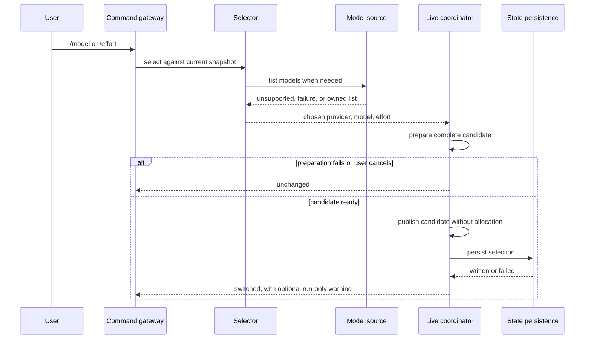

# Slash-command system architecture

Status: awaiting review

References:

- Product behavior: `docs/slash-commands-product.md`
- Research: `docs/slash-commands-research.md`
- hax behavior revision: `189816fb8b02956a6913d7638e6d2cc90a91d61a`
- zig-ai design reference: `e2c5aef5f93015322891028a2048a217e7081687`

## Boundaries

The command layer belongs to `cli`. It recognizes user control input, renders
command output, and drives terminal pickers. It does not enter `agent` or provider
wire adapters.

The shared agent loop continues to receive one immutable turn configuration. It does
not know whether that configuration came from startup, a resumed session, or an
interactive command.

Provider-specific model listing stays in `ai`. Configuration owns selection tiers
and the `state.json` document shape. The process composition root injects filesystem,
terminal, transport, clock, and environment capabilities.

## Components

### Command registry

An ordered immutable registry contains command name, optional alias, help text,
argument policy, display policy, and one erased synchronous handler. Registry order
is help order. Startup validation rejects duplicate names and aliases before the REPL
can dispatch anything.

The parser is allocation-free and returns borrowed name and argument slices. Dispatch
returns a tagged outcome:

- `not_command`, send the original line as a prompt;
- `handled`, return to the prompt;
- `exit`, end the REPL successfully.

The first milestone does not need `exit`, but the result exists so later `/new` or
session commands do not force a callback redesign.

### Interactive command gateway

`Interactive.run` receives one erased command gateway. It calls the gateway after
UTF-8 sanitation and before `Session.addUser`.

The gateway borrows the submitted bytes only for the synchronous call. It owns no
terminal line and may not retain the argument without copying it. A handled command
skips session admission, durability hooks, first-send setup, rendering, and provider
execution.

Prompt recall remains terminal-owned. Command handling does not add a second history
store.

### Per-turn source

`Interactive.run` also receives an erased per-turn source. Immediately before each
`agent.Loop.run`, it requests a borrowed snapshot containing:

- provider handle;
- model ID and model metadata;
- system prompt;
- tool slice;
- effort;
- image-input policy;
- model metadata and image sources used by late catalog refresh.

The snapshot remains valid until that loop call and its synchronous cleanup finish.
Command dispatch occurs only when no turn snapshot is borrowed. Existing fixed
`Interactive.Inputs` fields remain as a fallback for one-shot-style tests and simple
embedders.

### Live selection coordinator

A process-owned coordinator is the sole writer of interactive provider selection. It
has a stable address for the REPL lifetime and borrows long-lived process services:

- startup selection and provider-definition state;
- streaming and JSON transports;
- credential sources and local-provider facts;
- catalog service;
- tool runtime;
- live session and optional session log;
- static prompt-building inputs;
- compaction, usage, and presentation state;
- persistent state writer.

The coordinator owns the live provider runtime, final system prompt, and all derived
selection facts. `PrintRun` no longer copies provider, model, prompt, metadata, or
context limits into unrelated immutable locals for interactive execution.

It exposes only three classes of operation:

- borrow the current turn snapshot;
- prepare provider/model/effort candidates;
- commit one fully prepared candidate.

Selectors do not mutate these dependencies directly.

### Candidate

A candidate is allocator-owned and move-only. It contains every value that can fail
to construct:

- prospective config selection with the active preset exited;
- provider runtime;
- selected model, label, effort, and metadata;
- rebuilt system prompt;
- image and context policy;
- prepared session and log selection values;
- validated child-process selection;
- derived compaction and statistics values.

Picker rows and provider model-list results may remain separate short-lived owners.
The candidate borrows only process-lifetime services such as transports and static
prompt inputs.

Destroying an uncommitted candidate leaves the live run unchanged.

### Model source

Model enumeration is a small provider-neutral erased interface separate from the
streaming `ai.Provider` interface. Streaming providers do not gain optional methods
or CLI concepts.

The operation returns one owned tagged result:

- `unsupported`;
- `failure` with a bounded diagnostic;
- `models` with a bounded owned list.

Each model carries its wire ID plus optional display description and metadata. The
adapter owns protocol quirks. The CLI owns picker formatting and hax-compatible
sorting.

The list has explicit caps on model count, bytes per ID and description, total
retained bytes, and response size. Cancellation remains an operation error rather
than a fabricated failure row.

### Persistent selection state

Configuration owns a bounded state-document update that changes provider, model,
effort, and preset while preserving unrelated root fields.

Persistence performs an atomic same-directory replacement with private permissions.
It refuses symlink and non-regular targets, bounds paths and file size, syncs file
content before rename, and updates the in-memory state tier only after the rename
succeeds. It does not import or reuse the model-facing `tool.AtomicWrite` module.

The command coordinator treats persistent state as post-commit durability. Failure
cannot invalidate an already usable live provider, so it returns a run-only warning
and leaves the in-memory persistent tier unchanged.

## Selection flow

### Model or effort change

### Provider change

1. The selector snapshots the current provider ID and current displayed selection.
2. Availability probes produce advisory picker details. They do not construct the
   live replacement.
3. After provider choice, a prospective selection clears stale model and effort and
   exits the preset without mutating current config.
4. The coordinator constructs a temporary provider candidate using defaults.
5. The selector lists and chooses models against that candidate, then chooses effort.
6. The coordinator prepares the final candidate from the complete selection.
7. Cancellation or any failure destroys both temporary and final candidates.
8. Commit publishes the final candidate, then destroys the old provider runtime and
   prompt only after no borrowed snapshot can reference them.
9. Persistent state runs after live commit.

Re-selecting the current provider skips temporary provider reconstruction and starts
at model selection.

## Commit protocol

All fallible work happens before publication. Supporting modules may need prepared
move-only values so commit itself does not allocate:

- config selection plan;
- session owned selection;
- append-log owned selection;
- rebuilt prompt and provider runtime;
- validated fixed-size Bash environment assignments.

Commands run only while `agent.Session` is idle and no provider stream or tool launch
is active. The coordinator verifies that state before commit.

Publication is synchronous and non-cancellable:

1. publish the prospective run selection and exit the preset;
2. swap in the new provider runtime and prompt;
3. publish derived metadata, image, context, catalog, compaction, and presentation
   facts;
4. rewrite the tool runtime's fixed provider, model, and effort assignments;
5. publish prepared session and append-log selection values;
6. destroy replaced owned values;
7. attempt persistent state replacement;
8. render the switch notice and optional persistence warning.

No callback runs during steps 1 through 6. These steps must be allocation-free and
cannot return an ordinary runtime error after preparation. Programmer-invariant
violations are assertions, not partial-error recovery paths.

A session log stages new metadata but writes no item at command time. The next
non-empty durability append records it, matching hax.

## Failure model

- Parse and bad usage errors are handled command output.
- Picker cancellation is a successful no-op.
- Provider availability and model-list failures are bounded user-facing diagnostics.
- Candidate construction failure leaves all live values unchanged.
- Commit has no recoverable failure path after preparation.
- Persistent state failure leaves the live and session selection committed and emits
  one warning per process.
- Terminal setup or restoration follows the existing picker contract and never
  transfers provider ownership.

## Bounds

The architecture reuses existing prompt, provider-config, session, terminal, and
state-file limits. New model-list and command-registry limits are compile-time
constants. Registry validation and lookup remain linear because hax has fewer than
32 commands. No registry or picker data survives the synchronous command unless its
owner is explicitly moved into the live coordinator.

## Verification boundaries

- Parser and registry tests are pure and allocation-free.
- Command gateway tests use erased local handlers and prove handled lines never reach
  the session or provider.
- Model source tests run adapter fixtures through the public `ai` seam.
- Candidate tests inject failures at every allocation and prove the current snapshot
  is byte-for-byte unchanged.
- Commit tests compare the next turn snapshot, tool child environment, session
  selection, append-log selection, prompt model fact, context limit, and compaction
  inputs.
- State tests preserve unknown fields and reject races, symlinks, non-regular files,
  oversized documents, and write failures.
- PTY tests exercise nested picker success, cancellation, resize, and restoration.
